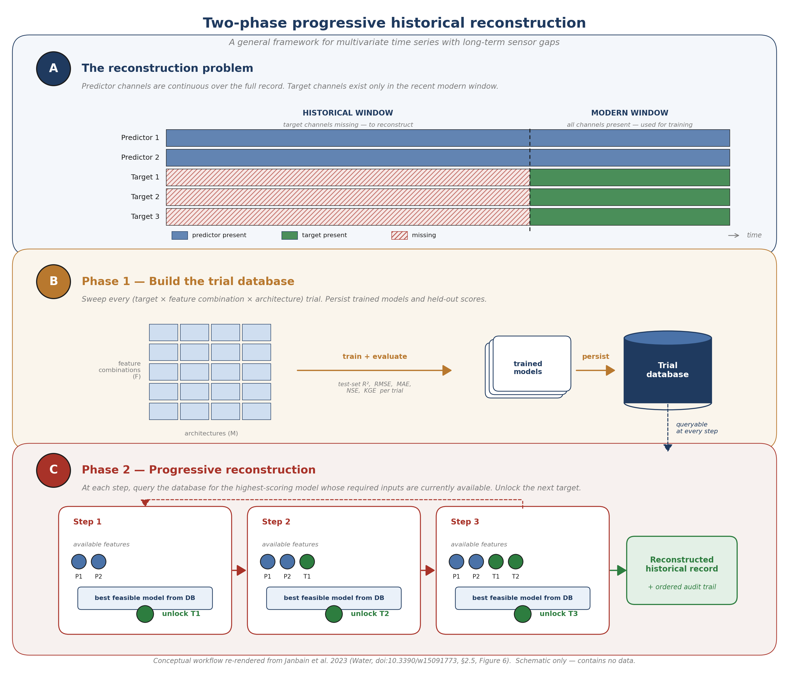

<div align="center">

# deep-ts-imputer

**A general framework for multivariate time-series historical reconstruction.**

Train deep learning models on the modern window where every variable exists,
then progressively reconstruct the long historical window where some
channels are missing — automatically picking the best feasible model at
each step.

LSTM · BiLSTM · GRU · CNN-BiLSTM (+ attention) · Optuna · Keras · Docker

[](https://www.python.org/)
[](https://www.tensorflow.org/)
[](LICENSE)
[](https://github.com/astral-sh/ruff)




<sub><i>Conceptual workflow re-rendered from Janbain et al. 2023 (<i>Water</i>, <a href="https://doi.org/10.3390/w15091773">doi:10.3390/w15091773</a> </i></sub>

</div>
---

## What this is

A clean, modular, fully-Dockerised framework for **filling gaps in
multivariate time series with deep learning**, with a particular focus
on the *historical reconstruction* setting in which some channels are
observed continuously over the long historical window and other
channels exist only for the recent modern window.

The framework was extracted and generalised from the research codebase
behind:

> **Janbain, I., Jardani, A., Deloffre, J., Massei, N. (2023).**
> *Deep Learning Approaches for Numerical Modeling and Historical
> Reconstruction of Water Quality Parameters in Lower Seine.*
> *Water* 15(9), 1773. [doi:10.3390/w15091773](https://doi.org/10.3390/w15091773)

The original code was a 1,500-line research script tightly coupled to a
single hydrological dataset. This repository turns it into a small
library you can point at any multivariate time series in any domain —
the Seine work is the validated case study, not the scope of the
framework. See the next section for the conditions under which it
applies.

> **Why imputation?** Sensor networks fail. Files arrive corrupted.
> Gauges go offline for maintenance. Downstream models — forecasting,
> anomaly detection, control loops — assume continuous data and break on
> NaNs. A learned imputer that exploits cross-channel correlations
> recovers far more signal than naive interpolation, while remaining a
> single, auditable artifact you can ship in a container.

---

## Generalisation across domains

The methodology applies to any domain that satisfies one structural
condition:

> Some channels are observed continuously over the historical window;
> other channels are missing for most of it; and the cross-channel
> correlation structure is strong enough that the missing ones can be
> learned from the available ones.

That pattern shows up everywhere environmental and industrial sensors
do. Concrete domains where the same two-phase pipeline applies without
modification:

| Domain                          | Continuously available channels                | Channels to reconstruct                                  |
|---------------------------------|------------------------------------------------|----------------------------------------------------------|
| Estuarine water quality         | Water level, tide gauges                        | Conductivity, dissolved oxygen, turbidity (the Seine case) |
| Groundwater hydrology           | Precipitation, river stage, temperature         | Piezometric heads at unmonitored wells                   |
| Air quality monitoring          | Meteorological station data, traffic counts    | PM₂.₅, NO₂, O₃ at stations decommissioned mid-record    |
| Industrial process control     | Pressure, temperature, flow                     | Concentration / composition probes that fail often       |
| Smart-grid load forecasting    | Calendar features, weather, neighbouring buses | Consumption at meters with retrospective gaps            |
| Building energy systems        | Outdoor temperature, occupancy proxies          | Sub-metered HVAC / lighting circuits                     |
| Marine biogeochemistry         | Sea surface temperature, salinity, currents     | Nutrients, chlorophyll-a, pCO₂                           |

What you change between domains is the YAML config, not the code. Pick
your input features, target features, look-back window, and candidate
architectures — everything else is identical to the Seine run.

### What you need to bring

1. A **modern window** in which every variable you care about is
   present at the same time resolution. This is the training set.
2. A **historical window** in which the predictor channels are present
   continuously and the target channels are partly or wholly missing.
   This is what gets reconstructed.
3. A **column-naming convention** that lets the spatial helpers parse
   `(parameter, station, depth)` if your archive has multiple sites or
   probe depths. The default convention is
   `{Parameter}_{Station}_{Depth}` (depth optional). Bring an alias map
   in the config if your CSV headers do not match.
4. Strong cross-channel correlations between the available and missing
   channels. Run `analyze.py` first to verify; if your EDA shows
   uncorrelated channels, no model will save you.

### What you do not need to bring

- A specific deep-learning framework opinion. The model factory exposes
  five architectures and a registration hook for your own.
- A specific hyper-parameter search strategy. Optuna with TPE + pruning
  is built in, but the script also runs without it.
- A GPU. CPU works for everything in this README; the Docker image is
  CPU by default and the GPU swap is one line.

---

## Highlights

- **Two-phase methodology.** Phase 1 trains a grid of models over
  `(target × feature combination × architecture)` and stores results in
  a queryable database. Phase 2 walks back over the full historical
  record, picking the best *feasible* model at each step (one whose
  required inputs are currently available), filling the next target,
  and unlocking the next reconstruction step. The order is learned from
  the data.
- **Exploratory data analysis built in.** Per-variable distributions,
  annotated correlation heatmap, hierarchically-clustered correlation
  dendrogram, missingness matrix, time-series overview, and depth-aware
  spatial helpers — produced by a single command.
- **Automatic gap reconstruction.** A trained model + the saved
  scalers + a CSV with NaNs is the only thing `scripts/reconstruct.py`
  needs to produce a fully-imputed file. No manual feature engineering,
  no hand-tuning per gap.
- **Five built-in architectures.** LSTM, BiLSTM, GRU, BiGRU, and
  CNN-BiLSTM (with optional self-attention). Add your own by registering
  one function.
- **Hyper-parameter search built in.** Optuna with TPE sampling +
  median pruning, plus a `merge_best_params` helper that retrains the
  winning configuration at full budget.
- **Hydrology-aware metrics.** RMSE, MAE, R², Nash–Sutcliffe Efficiency
  (NSE), Kling–Gupta Efficiency (KGE) — the scores reviewers actually
  ask for.
- **Reproducible by construction.** Typed YAML configs, fixed seeds,
  fit-on-train-only scalers, strict chronological splits, persisted
  artifacts (model + scalers + plots + metrics + units + Optuna study).
- **Tested.** Pure-Python tests for windowing, metrics, units, the
  results database, and the depth-aware column parser; parametrised
  smoke tests for every registered architecture.

---

## Quickstart (60 seconds, no data required)

```bash
git clone <repo-url>
cd <repo-name>
make dev          # pip install -e ".[dev]"
make demo         # generates synthetic data + trains a small BiLSTM
```

You will see something like:

```
2026-04-08 12:34:56 | INFO    | train | Loading dataset from data/synthetic.csv
2026-04-08 12:34:56 | INFO    | train | Dataset shape: inputs=(8760, 2), targets=(8760, 3)
2026-04-08 12:34:57 | INFO    | train | Windows: train=(4881, 24, 2) val=(1226, 24, 2) test=(2604, 24, 2)
2026-04-08 12:35:18 | INFO    | train | Test metrics on synthetic data
2026-04-08 12:35:18 | INFO    | train | Artifacts written to outputs/synthetic_demo
```

Open the prediction plot under `outputs/synthetic_demo/predictions.png`
to inspect the model's reconstructions on the held-out test set.

Prefer Docker?

```bash
docker compose -f docker/docker-compose.yml run --rm demo
```

---

## Quickstart (your own data)

Your CSV needs one date column and at least two numeric columns
(predictors + targets). Drop a config in `configs/`:

```yaml
# configs/my_dataset.yaml
seed: 42
output_dir: outputs/my_dataset

data:
  path: data/my_sensors.csv
  date_column: timestamp
  input_features: [temperature, pressure, flow_rate]
  target_features: [dissolved_oxygen, turbidity]
  date_begin: "2022-01-01"
  date_end: "2024-12-31"
  scaler: standard
  units:
    temperature: "°C"
    pressure: "bar"
    flow_rate: "m³/s"
    dissolved_oxygen: "mg·L⁻¹"
    turbidity: "NTU"

window:
  look_back: 48
  horizon: 1

model:
  name: cnn_bilstm
  units: 64
  num_layers: 2
  dropout: 0.2
  cnn_filters: 32
  use_attention: true

train:
  epochs: 150
  batch_size: 128
  learning_rate: 0.001
  early_stopping_patience: 20
```

Then:

```bash
python scripts/tune.py --config configs/my_dataset.yaml          # search + retrain
python scripts/reconstruct.py \
    --config configs/my_dataset.yaml \
    --model outputs/my_dataset/model.keras \
    --input data/my_sensors_with_gaps.csv \
    --output outputs/my_dataset/reconstructed.csv
```

Same command shape regardless of domain.

---

## Project layout

```
deep-ts-imputer/
├── src/deep_ts_imputer/
│   ├── data/             # loading, scaling, sliding windows
│   ├── eda/              # exploratory data analysis (parameter + spatial)
│   ├── models/           # five architectures + factory
│   ├── training/         # Keras training loop with callbacks
│   ├── tuning/           # Optuna search + best-params merge
│   ├── experiments/      # Phase 1 grid + Phase 2 progressive loop + DB
│   ├── evaluation/       # metrics + plots
│   ├── imputation/       # production-side gap filler
│   └── utils/            # typed config, seeding, logging, units
├── scripts/
│   ├── analyze.py                    # run EDA on a config or raw CSV
│   ├── train.py                      # train one config
│   ├── tune.py                       # Optuna search + retrain
│   ├── run_grid.py                   # Phase 1 — populate results database
│   ├── run_progressive.py            # Phase 2 — progressive reconstruction
│   ├── reconstruct.py                # one-shot gap-filling
│   ├── make_methodology_diagram.py   # render the methodology schematic
│   └── generate_synthetic_demo.py    # zero-data demo dataset
├── configs/
│   ├── default.yaml
│   ├── synthetic_demo.yaml
│   ├── seine_water_quality.yaml
│   ├── synthetic_grid.yaml
│   └── seine_grid.yaml
├── docker/
│   ├── Dockerfile
│   └── docker-compose.yml
├── examples/seine_water_quality/   # paper-aligned reproduction notes
├── images/                         # rendered figures (see below)
├── tests/                          # pytest suite
├── pyproject.toml
├── Makefile
└── README.md
```

The `images/` folder holds rendered figures used in the README and in
external documentation. The methodology schematic generated by
`scripts/make_methodology_diagram.py` lives there as both PNG and SVG.

---

## How it works

1. **Load** the CSV, parse the date column, optionally clip a date
   window and linearly interpolate any short gaps in the predictor
   columns.
2. **Split chronologically** into train / val / test. Default
   56 / 14 / 30. Scalers are fit *only* on the training block — no
   leakage.
3. **Window** the scaled series into supervised
   `(look_back, n_features_in) → (horizon × n_features_out)` tensors.
4. **Build** the requested model from the config (`bilstm`,
   `cnn_bilstm`, …). Compile with Adam + your chosen loss.
5. **Train** with early stopping and a best-only checkpoint. Optionally
   prefix this with an Optuna search; the best trial is then re-trained
   at full epoch budget.
6. **Evaluate** on the held-out test set in the original (unscaled)
   units. Persist `metrics.json` with RMSE / MAE / R² / NSE / KGE plus
   prediction and scatter plots.
7. **Reconstruct** any new file by loading the saved model and scalers
   and sliding the model along the series, filling each NaN with the
   inverse-scaled prediction.

---

## Data conventions — units and column names

The pipeline itself is mathematically unit-agnostic: MinMax / Standard /
Robust scalers do not care what units a column is in, the inverse
transform recovers the original scale, and metrics are reported in
those original units. So a model trained on metres and one trained on
centimetres will produce the same R² — only the absolute RMSE will
differ.

That said, *interpreting* the artifacts requires units. The framework
handles this with two small conventions:

### `units` — column → unit string

Set `data.units` in the config to a mapping from column name to unit
string. The units are used in plot axis labels, persisted in
`outputs/<run>/units.json` and embedded in `metrics.json` so a future
reader can tell what an `rmse: 38.1` actually represents.

```yaml
data:
  units:
    Water_level_Honfleur: "m"
    Conductivity_Tancarville_Surface: "μS·cm⁻¹"
    Dissolved_Oxygen_Tancarville_Surface: "mg·L⁻¹"
    Turbidity_Tancarville_Bottom: "NTU"
```

Units are never consumed by the model. They are pure metadata — if you
forget to set them, training still runs and metrics are still correct,
you just lose the labels.

### `column_aliases` — raw CSV header → clean identifier

Real-world environmental archives often embed units directly in column
headers (e.g. `Conductivity_Tancarville_Surface (μS·cm–1)`), which
makes them awkward to refer to in YAML configs. Rather than touch the
source CSV, declare an alias:

```yaml
data:
  column_aliases:
    "Conductivity_Tancarville_Surface (μS·cm–1)": "Conductivity_Tancarville_Surface"
    "Water_level_Honfleur (m)": "Water_level_Honfleur"
```

`load_timeseries` applies the alias map immediately after reading the
file, so every other piece of the pipeline works with clean,
unit-suffix-free identifiers. Aliases are forgiving: keys that do not
match any column are silently ignored, so a single alias map can be
reused across related datasets with slightly different headers.

---

## Exploratory data analysis

Before fitting any model you should *look* at your data. The `eda`
subpackage and `scripts/analyze.py` produce a fixed set of figures that
cover the questions reviewers always ask: what does each variable look
like, how are they correlated, where are the gaps?

```bash
python scripts/analyze.py --config configs/seine_water_quality.yaml
# or, on any CSV directly:
python scripts/analyze.py --input data/synthetic.csv --out outputs/eda
```

The EDA functions split into two complementary views.

**Parameter-level analysis** (how variables interact at one station):

| Artifact                       | What it shows                                              |
|--------------------------------|------------------------------------------------------------|
| `summary_statistics.csv`       | count / mean / std / quantiles / % missing                 |
| `distributions.png`            | Histogram + KDE for every numeric column                   |
| `correlation_heatmap.png`      | Annotated Pearson correlation matrix                       |
| `correlation_clustermap.png`   | Hierarchically-clustered correlation dendrogram            |
| `missing_data.png`             | Missing-value matrix + per-column percentage               |
| `timeseries_overview.png`      | One subplot per variable, sharing the time axis            |

**Spatial / station-level analysis** (how a single variable behaves
along a transect or across a network):

| Function                                              | What it shows                                                              |
|-------------------------------------------------------|----------------------------------------------------------------------------|
| `eda.plot_station_correlation_grid(df, stations, parameters)` | One inter-station correlation heatmap per parameter, with surface and bottom probes treated as separate rows/columns |
| `eda.plot_surface_vs_bottom(df, stations, parameters)`        | Overlaid surface and bottom traces per `(station, parameter)` cell — answers "do the two probes agree?" |
| `eda.plot_parameter_per_station(df, stations, parameters, depth="Surface")` | Small multiples: rows = parameters, columns = stations, one chosen depth   |
| `eda.parse_column_name(col, stations, parameters)`            | Utility that splits `Conductivity_Tancarville_Surface` into `(parameter, station, depth)` |

Surface vs. bottom is a first-class dimension, not a footnote. The
Lower Seine archive measures the same parameter at two depths at
several stations (Tancarville, Fatouville…), and any spatial analysis
that ignores the surface–bottom distinction will silently smear the two
layers into a single mean. The plot helpers above expect column names
of the form `{Parameter}_{Station}_{Depth}` (the convention used in the
paper); stations with a single probe simply omit the depth suffix and
the parser handles them transparently.

---

## Methodology — two-phase progressive reconstruction

The framework implements the two-phase strategy described in §2.5 /
Figure 6 of Janbain et al. 2023. The headline contribution is *not*
"train one model and call predict" — it is the combination of an
exhaustive Phase 1 trial sweep with a Phase 2 loop that uses the
resulting database to choose the best feasible model at each
reconstruction step.

The key idea: **what's reconstructed first depends on what's possible
first.** At step 1 only the continuously-available predictor channels
are present, so the algorithm picks the target whose best
predictor-only model has the highest R² — typically the one that
correlates most strongly with the predictors. Once that target exists
at every timestamp, it joins the available-features set; models that
*require* it become feasible and usually beat the predictor-only
baselines, so the next target is reconstructed using the new richer
input set. The unlock chain continues until every target is filled.
None of this ordering is hand-coded; it falls out of the database.

### Phase 1 — populate the results database

```bash
python scripts/run_grid.py --grid configs/seine_grid.yaml
```

The grid spec lists every `(target, input_combination, model)` triple
to train. Each trial appends one row to `outputs/<run>/results.csv`:

| target                              | station     | input_features          | model_name | r2   | rmse  | model_path |
|-------------------------------------|-------------|-------------------------|------------|------|-------|------------|
| Conductivity_Tancarville_Surface    | Tancarville | [WL_T]                  | bilstm     | 0.85 | 50.1  | …/m1.keras |
| Conductivity_Tancarville_Surface    | Tancarville | [WL_H, WL_T]            | cnn_bilstm | 0.92 | 39.8  | …/m2.keras |
| Dissolved_Oxygen_Tancarville_Surface| Tancarville | [WL_H]                  | gru        | 0.55 | 1.04  | …/m4.keras |
| Dissolved_Oxygen_Tancarville_Surface| Tancarville | [WL_T, conductivity]    | bilstm     | 0.78 | 0.51  | …/m3.keras |
| …                                   | …           | …                       | …          | …    | …     | …          |

The database is just a CSV — diffable in git, queryable with pandas,
and trivially loadable from anywhere.

### Phase 2 — progressive historical reconstruction

```bash
python scripts/run_progressive.py \
    --db outputs/seine_grid/results.csv \
    --series data/seine_water_levels_1990_2022.csv \
    --look-back 48 \
    --available Water_level_Honfleur Water_level_Tancarville \
                Water_level_Caudebec Water_level_Duclair Water_level_Rouen \
    --targets Conductivity_Tancarville_Surface \
              Dissolved_Oxygen_Tancarville_Surface \
              Turbidity_Tancarville_Bottom \
    --output outputs/seine_grid/historical_reconstruction.csv
```

The script writes two artifacts:

- `historical_reconstruction.csv` — the same input series with every
  requested target column filled in
- `historical_reconstruction_order.csv` — the audit trail showing which
  target was reconstructed at which step, with which model, using which
  inputs, and how many cells were filled

Example audit trail (synthetic estuary, 3 targets):

```
step  target            model       n_inputs  inputs                         r2_phase1  n_filled
1     conductivity      cnn_bilstm  2         wl_upstream, wl_downstream     0.94       8736
2     dissolved_oxygen  bilstm      3         wl_upstream, wl_downstream,    0.81       8736
                                              conductivity
3     turbidity         cnn_bilstm  4         wl_upstream, wl_downstream,    0.67       8736
                                              conductivity, dissolved_oxygen
```

`run_progressive.py` also writes a waterfall figure
(`<output>_waterfall.png`) showing the order in which targets were
unlocked, coloured by Phase-1 R² and annotated with the model chosen at
each step.

### Reproducing the methodology schematic

A publication-ready schematic of the two-phase methodology can be
regenerated from source at any time:

```bash
make methodology-diagram
```

This runs `scripts/make_methodology_diagram.py` and writes the figure
to `images/methodology_workflow.svg` (vector) and
`images/methodology_workflow.png` (200 DPI raster).

### One-shot mode is still available

If you only need to fill gaps in *one* target with *one* trained model
(no grid, no progressive loop), `scripts/reconstruct.py` is unchanged:

```bash
python scripts/reconstruct.py \
    --config configs/seine_water_quality.yaml \
    --model  outputs/seine_water_quality/model.keras \
    --input  data/seine_with_gaps.csv \
    --output outputs/seine_water_quality/reconstructed.csv
```

Use one-shot mode for routine gap-filling on a single sensor; use the
two-phase pipeline when you have to reconstruct multiple missing
parameters from the same upstream features and the order matters.

---

## Configuration reference

Every config maps 1-to-1 to the dataclasses in
`src/deep_ts_imputer/utils/config.py`. The most-used knobs:

| Section | Field                       | Meaning                                                       | Default  |
|---------|-----------------------------|---------------------------------------------------------------|----------|
| data    | `input_features`            | Predictor columns                                             | —        |
| data    | `target_features`           | Columns to impute                                             | —        |
| data    | `train_split` / `val_split` | Chronological fractions                                       | 0.7 / 0.8|
| data    | `scaler`                    | `minmax` \| `standard` \| `robust`                            | `minmax` |
| data    | `units`                     | Column → unit-string map (plot/metric labels only)            | `{}`     |
| data    | `column_aliases`            | Raw CSV header → clean identifier map                         | `{}`     |
| window  | `look_back`                 | History length fed to the encoder                             | 24       |
| window  | `horizon`                   | Number of steps predicted per window                          | 1        |
| model   | `name`                      | `lstm` \| `bilstm` \| `gru` \| `bigru` \| `cnn_bilstm`        | `bilstm` |
| model   | `units` / `num_layers`      | Recurrent width and depth                                     | 64 / 2   |
| model   | `dropout`                   | Dropout between recurrent layers                              | 0.1      |
| train   | `epochs`                    | Max epochs (early stopping cuts this short)                   | 100      |
| train   | `early_stopping_patience`   | Epochs without val improvement before stopping                | 15       |
| tune    | `n_trials`                  | Optuna trials                                                 | 30       |
| tune    | `sampler` / `pruner`        | `tpe`/`random` and `median`/`hyperband`/`none`                | `tpe`/`median` |

---

## Hyper-parameter search

`scripts/tune.py` runs an Optuna study over the four most consequential
knobs (`units`, `num_layers`, `dropout`, `learning_rate`, plus
`cnn_filters` for `cnn_bilstm`), with TPE sampling and median pruning.
Each trial trains a half-budget model and reports the best validation
loss; pruned trials cost almost nothing. After the study, the winning
configuration is automatically re-trained at the full epoch budget and
all artifacts (model, scalers, plots, `metrics.json`, `best_params.json`,
`optuna_trials.csv`) land in `outputs/<study_name>/`.

If you set `tune.storage: sqlite:///path.db` the study becomes
resumable and parallelisable across processes.

---

## Reproducibility

- Every script seeds Python, NumPy and TensorFlow from `cfg.seed`.
- Splits are strictly chronological — no shuffling, ever.
- Scalers are fit only on the training block.
- The full config used for a run is the input file in `configs/` —
  commit it alongside your `outputs/` directory and a future you (or a
  reviewer) can rerun the exact experiment.
- Pinned dependency ranges in `requirements.txt` and `pyproject.toml`.
- A Docker image with the same TensorFlow version we develop against,
  so a fresh laptop and a CI server produce the same numbers.

---

## Testing

```bash
make test              # pytest -q
make lint              # ruff check
```

The test suite covers:

- `tests/test_windowing.py` — window shapes, alignment, edge cases
- `tests/test_metrics.py` — perfect-prediction and known-value checks
  for every metric
- `tests/test_units.py` — unit labelling and column-alias logic
- `tests/test_database.py` — results-database persistence, feasibility
  filtering, best-feasible selection, and the full progressive unlock
  pattern
- `tests/test_eda_parser.py` — depth-aware column-name parsing
- `tests/test_models.py` — parametrised smoke tests that build, compile
  and run a forward pass through every registered architecture
  (including `cnn_bilstm` with attention)

---

## Roadmap

- [x] Two-phase grid + progressive reconstruction loop (Janbain 2023, §2.5)
- [x] Spatial / station-level EDA functions with surface/bottom support
- [x] Waterfall visualisation of the Phase 2 unlock order
- [x] Units and column-alias handling
- [x] Code-generated methodology schematic
- [ ] PyTorch backend alongside Keras
- [ ] Quantile / Tail-Huber loss for extreme-event sensitivity
- [ ] SHAP-based per-feature attribution baked into the eval pipeline
- [ ] MLflow tracking integration (`tracking_uri` in the train config)
- [ ] Native multi-horizon evaluation (currently we report `horizon=1`)
- [ ] Probabilistic outputs (Monte-Carlo dropout, deep ensembles)

PRs welcome.

---

## Citation

If you use this code, please cite the underlying paper:

```bibtex
@article{janbain2023seinewq,
  title   = {Deep Learning Approaches for Numerical Modeling and Historical
             Reconstruction of Water Quality Parameters in Lower Seine},
  author  = {Janbain, Imad and Jardani, Abderrahim and Deloffre, Julien
             and Massei, Nicolas},
  journal = {Water},
  volume  = {15},
  number  = {9},
  pages   = {1773},
  year    = {2023},
  doi     = {10.3390/w15091773}
}
```

A `CITATION.cff` file is included for GitHub's "Cite this repository"
button.

---

## License

MIT — see [LICENSE](LICENSE).

## Author

**Imad Janbain** — Applied Machine Learning Scientist
[LinkedIn](https://www.linkedin.com/in/imad-janbain-885948225/) · imad.janbain@hotmail.com
